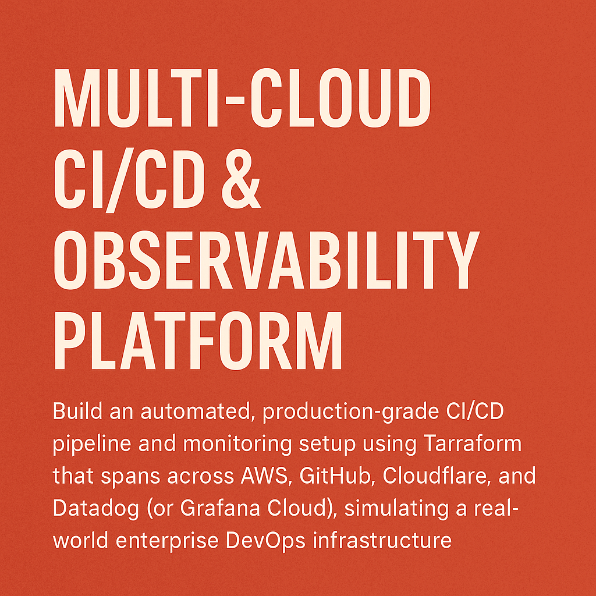

# Multi-Cloud CI/CD & Observability Platform



## Project Summary
This project delivers an enterprise-grade multi-cloud CI/CD pipeline and observability stack using **Terraform** to provision infrastructure across:

- **AWS** (networking, compute, IAM, etc.)
- **GitHub** (repository + CI/CD via GitHub Actions)
- **Cloudflare** (DNS, WAF, SSL)
- **Datadog** (monitoring + dashboards)

Built to simulate real-world DevOps workflows in a modular, automated, and secure fashion.

---

## Project Structure
```
├── main.tf
├── provider.tf
├── variables.tf
├── outputs.tf
├── terraform.tfvars.example
├── backend.tf
├── Makefile
├── terraform-wrapper.sh
├── .gitignore
├── LICENSE
├── modules/
│   ├── network/         # VPC, Subnets, Routing
│   ├── compute/         # EC2, ALB, Lambda, IAM
│   ├── dns/             # Cloudflare Zone, Records, SSL
│   ├── ci_cd/           # GitHub repo + secrets + Actions
│   └── observability/   # Datadog monitors + dashboard
└── .github/workflows/deploy.yml
```

---

## Key Features

### 1. Modular Terraform Architecture
- Split into reusable modules
- Remote state via S3 + DynamoDB
- Workspace support for `dev`, `stage`, and `prod`

### 2. CI/CD via GitHub Actions
- GitHub OIDC to assume AWS roles securely
- Terraform plan/apply triggered on commit
- `tflint`, `tfsec`, and `checkov` for IaC scanning

### 3. DNS + CDN via Cloudflare
- CNAME record targeting AWS ALB
- Page rule: "Cache Everything"
- Basic WAF rules for security

### 4. Observability with Datadog
- AWS integration via Datadog IAM role
- EC2 CPU alert & Lambda error monitor
- Interactive dashboard (CPU + error trends)

### 5. Security Best Practices
- IAM with least-privilege policies
- GitHub → AWS OIDC auth (no hardcoded creds)
- All secrets in GitHub Actions encrypted store

---

## Getting Started

### Prerequisites
- AWS account + IAM setup
- GitHub personal access token
- Datadog API & App keys
- Cloudflare domain + API token

### 1. Clone and Configure
```bash
git clone https://github.com/<your-org>/multi-cloud-platform.git
cd multi-cloud-platform
cp terraform.tfvars.example terraform.tfvars
# Fill in secrets and config values
```

### 2. Use Makefile or Wrapper
```bash
make init
make plan
make apply

# or using shell wrapper
./terraform-wrapper.sh init
./terraform-wrapper.sh plan
```

---

## Author
**Patrick Ogbue**  
[LinkedIn Profile](https://www.linkedin.com/in/patrick-ogbue)

---

## License
This project is licensed under the [MIT License](./LICENSE).

---

> Designed for learning, enterprise simulation, and advanced DevOps automation scenarios.....
